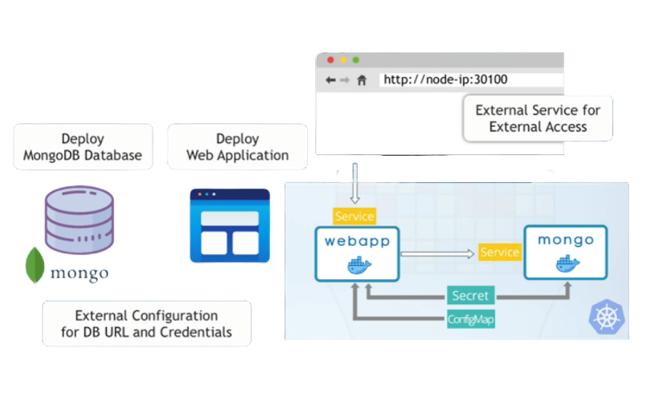

# k8s-demo-app ✨



**Project Overview**
Demo web application with some CRUD operations and MongoDB integrated with Kubernetes
Docker Hub image : https://hub.docker.com/repository/docker/chabba/k8s-demo-app

## Prerequisites :white_check_mark:
- [x] Installation of Docker locally - https://www.docker.com/products/docker-desktop/
- [x] Installation of minikube locally - https://minikube.sigs.k8s.io/docs/start/
- [x] Recomended editor is VSCode
 <br/>

## Getting Started - Installation :computer:
```
minikube start --driver docker    or    minikube start
minikube status
kubectl get node
kubectl apply -f mongo-config.yaml   
kubectl apply -f mongo-secret.yaml    
kubectl apply -f mongo.yaml 
kubectl apply -f webapp.yaml      
kubectl get all
kubectl get node -o wide
kubectl port-forward service/webapp-service 7080:3000
```

## Author 
- Full Name : **Chandur Dissanayake**
